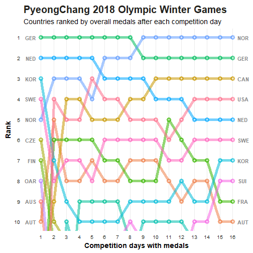

# 언급량 도출
```{r, include = FALSE} 
library(dplyr)
library(ggplot2)
library(lubridate)
library(stringr)
library(data.table)
library(kableExtra)
library(plotly)
dir <- 'C:/Users/JDW/Desktop/PROJECT/PRODUCEX/CRAWLING DATA/2020ver'
pxdata <- readRDS(str_glue("{dir}/pxdata.rds"))
boylist <- readLines('C:/Users/JDW/Desktop/PROJECT/PRODUCEX/final_boylist.txt')
```


<center>*사진출처 : 엠넷*</center>   
<br>

&nbsp;이제 분석의 마무리 작업으로 지금까지 전처리한 데이터를 기반으로 어느 연습생의 언급량이 높았었는지를 직접 확인해 볼 시간입니다. 데이터 수집부터 이전에 진행한 시각화까지 다소 짧은 분량은 아니었는데요. 이번 시각화를 통해서 분석을 마무리를 지어볼까 합니다.   

## 데이터 시각화 
 
&nbsp; 지금까지 수집한 데이터는 실제로 방송을 시청하는 시청자들이 게시판에 작성한 게시물들의 제목들(`p_title`) 입니다. 즉, 방송을 보고 투표를 할 확률이 높은 시청자들의 의견이 담긴 텍스트인데요. 분석에 앞서 한가지 가정을 했었습니다. 언급량이 높으면 높을수록 그만큼 인기도 많을 것이다 였는데요. 사람들 입에서 회자가 많이 된다는 것은 그만큼 관심과 인기가 있다는 의미이고, 그것이 투표량과도 상관이 있을것이다 가정하였습니다.   

## 분석 범위 설정
&nbsp; "프로듀스 X 101"은 101명의 연습생들이 무대에서 경연을 통해 경쟁을 펼치고, 이를 본 시청자들의 투표를 통해서 최종 11명의 아이돌 멤버를 선발한다는 컨셉의 방송인데요. 마지막 방송날에 인기가 높았던 20명의 연습생들이 생방송 무대에서 경합을 펼쳤습니다. 마지막 방송까지 살아남은 최종 20명을 대상으로 분석을 진행해 보도록 하겠습니다. 

미리 마지막 생방송에 진출한 스무명의 연습생 이름을 `final_boylist.txt` 파일에 저장해 두었었고, 이를 불러오겠습니다. 

```{r, eval = FALSE}
boylist <- readLines('./final_boylist.txt')
boylist
```

```{r, echo=FALSE}
boylist
```

&nbsp; 언급량은 연습생별로 연습생이 언급된 게시물들의 갯수가 몇개인지를 세어보는 방식으로 집계할 것입니다. 그런데 게시물들의 특성상 연습생의 fullname을 적는 경우보다 name만 적는 경우가 많이 있었기에 먼저 호출한 `boylist`에서 이름만 추출하겠습니다. 

```{r}
boylist2 <- str_sub(boylist, -2, -1) # 뒤에서 두번째 글자부터 뒤에서 첫번째 글자까지만을 저장 
boylist2
```

## 언급량 집계

### 별명 정리 
&nbsp; 글을 작성할 때 이름을 적는 경우도 있지만 경우에 따라서는 별명이나 애칭으로 부르는 경우도 더러 있었습니다. 별명이나 애칭은 대상을 지칭하는 의미에서 결국 이름으로 부르는것과 다를바가 없을 것입니다. 때문에 각 연습생별로 자주 쓰이는 별명을 사전에 조사하여 데이터에서 그 별명을 연습생의 이름으로 변경시켜주는 작업을 진행하겠습니다.   

```{r}
# 연습생별 별명 
boy_nickname <- list(
  c('욯'),               # 김요한
  c('짤랑이'),           # 김우석
  c('지녁'),             # 이진혁
  c('스누피', '식빵맨'), # 한승우
  c('밍규', '밍구'),     # 김민규
  c('조골무'),           # 조승연
  c('도깅', '도옵'),     # 남도현
  c('형깅'),             # 송형준
  c(),                   # 이은상
  c('금동'),             # 금동현
  c(),                   # 차준호
  c('표동'),             # 손동표
  c('쁘띠'),             # 황윤성
  c('말티쥬', '강미니'), # 강민희
  c(),                   # 구정모
  c(),                   # 이한결
  c('유넨'),             # 송유빈
  c('함옵', '함깅'),     # 함원진
  c('토카츄'),           # 토니
  c('마리몽')            # 이세진
)

names(boy_nickname) <- boylist

# 별명 수정 전 
pxdata %>% filter(str_detect(p_title, '욯')) %>% nrow();
pxdata %>% filter(str_detect(p_title, '요한')) %>% nrow()

# 별명 수정
for(i in seq(1, length(boylist))){
  if(length(unlist(boy_nickname[boylist[i]])) != 0){
    pxdata <- pxdata %>%
      mutate(p_title = stringi::stri_replace_all_fixed(p_title, paste(unlist(boy_nickname[i])), names(boy_nickname[i]), vectorize_all = F))
  }
}

```
&nbsp;검색을 통하여 별명을 찾아보았고, 연습생별 자주 쓰이는 별명을 `list`형식으로 저장하였습니다. 뚜렷한 별명이 없는 연습생은 공란으로 두었고, 별명의 경우이더라도 일상에서 많이 쓰이는 일반명사로 사용된 별명은 별명에서 제외하였습니다.   

```{r}
# 별명 수정 후
pxdata %>% filter(str_detect(p_title, '욯')) %>% nrow();
pxdata %>% filter(str_detect(p_title, '요한')) %>% nrow()
```

&nbsp;별명이 모두 이름으로 변경된 것을 확인할 수 있습니다. 

&nbsp;그런다음 for문을 통해 연습생별로 언급량을 집계해 보겠습니다.   

```{r, cache=TRUE}
final_boys <- c()
boys <- c()

# 연습생별 언급게시글의 개수 `final_boys` 리스트에 저장 
for(i in 1:length(boylist2)){
    final_boys[i] <- nrow(pxdata[grep(boylist2[i], pxdata$p_title), ])           
}

# 연습생 - 연습생 언급게시 개수 데이터프레임화 
boys <- data.frame(boy = boylist, 
                   mention = as.numeric(final_boys), 
                   stringsAsFactors = F) 

str(boys)
```

&nbsp;이를 시각화하여 알아보도록 하겠습니다. 

## 언급량 시각화

### Barchart
```{r, out.width="1000px"}
boys %>% 
    ggplot(aes(x = boy, y = mention)) + 
    geom_col() + 
    geom_text(aes(label = mention), vjust = -.5, size = 2) + 
    theme(axis.text.x = element_text(angle = 45)) 
```

```{r, out.width="1000px"}
boys %>% 
    ggplot(aes(x = reorder(boy, -mention), y = mention)) + 
    geom_col() + 
    geom_text(aes(label = mention), vjust = -.5, size = 2) + 
    theme(axis.text.x = element_text(angle = 45)) 

```

&nbsp;시각화를 진행한 결과 **김우석**, **조승연**, **김민규**, **이은상**, **구정모**, **김요한**, **남도현**, **송형준**, **한승우**, **강민희**, **이진혁** 순으로 언급량이 많은것을 확인 할 수 있었습니다.   

&nbsp;하지만 이것은 전체기간을(06/01 ~ 07/19) 대상으로 집계한 언급량이기 때문에 연습생들의 시간에 따른 언급량의 변화는 찾아 볼 수가 없네요. 방송이 진행되면서 멋진 무대를 소화해 낸 연습생은 순위가 올라간 경우도 있었고, 반대로 다른 여러 요인들로 인해 인기가 하락한 경우도 종종 볼 수 있었습니다.   

&nbsp;그렇다면 이번에는 에피소드별로 연습생들의 언급량이 어떻게 변화했는지를 확인해 보도록 하겠습니다.   

### 에피소드별 언급량 변화 

```{r, message=FALSE, cache=TRUE}
# 에피소드별 언급량
temp_mention <- c()
episode_mention <- c()

for(i in seq(1, 20)){
  print(boylist[i])
  temp_mention <- pxdata %>%
    filter(str_detect(p_title, boylist2[i])) %>%
    group_by(p_episode) %>%
    summarise(mention = n()) %>%
    mutate(boy = boylist[i])

  episode_mention <- rbind(episode_mention, temp_mention)
}

```

```{r}
DT::datatable(episode_mention)
```

&nbsp;이렇게 에피소드별, 연습생별로 나누어진 데이터를 Barchart를 통해 시각화 해보겠습니다.   

```{r, out.width="1000px"}

episode_mention %>% 
    ggplot(aes(x = as.factor(p_episode), y = mention)) + 
    geom_col() + 
    geom_text(aes(label = mention), vjust = -1, size = 2) + 
    facet_wrap( ~ boy) + 
    labs(x = '에피소드', y = '언급량')
```

&nbsp;확실히 시간에 따른 연습생의 언급량이 어떻게 변화하였는지가 파악이 됩니다. 그렇지만 값이 높은 순서로 정렬이 되어 있지 않아 한눈에 파악하기 약간 어려운거 같은데 11주차 방송 기간을 기준으로 연습생의 언급량을 재정렬 해보겠습니다.   

### Barchart(11화 언급량 기준 정렬)

```{r, out.width="1000px"}
episode_level <- episode_mention %>%
  filter(p_episode == 11) %>%
  arrange(desc(mention)) %>% 
  .$boy

episode_mention %>% 
  mutate(boy = factor(boy, levels = episode_level)) %>% 
  ggplot(aes(x = as.factor(p_episode), y = mention)) + 
  geom_col() + 
  geom_text(aes(label = mention), vjust = -1, size = 2) + 
  facet_wrap( ~ boy) + 
  labs(x = '에피소드', y = '언급량')
```

&nbsp;11회차를 기준으로는 **조승연**, **구정모**, **김우석**, **김민규**, **한승우**, **김요한**, **남도현**, **이은상**, **이진혁**, **금동현**, **송형준** 순으로 언급된 것을 볼 수 있습니다. 실제로 데뷔한 연습생들과 비교해 보니 전체 11명중 7명이 속하네요.(물론 잘못된 투표였다는 발표가 있었지만요.) 그렇지만 온라인 커뮤니티에서 시청자들이 어떤 연습생에 대해 많이 얘기하고 관심이 있어하는지를 엿볼 수 있던 기회였습니다.   

&nbsp;이제 마지막으로 Bump chart를 제작하여 연습생들의 언급도가 어떻게 변화하였는지를 확인해 보도록 하겠습니다.   

### Bump chart

```{r, echo=FALSE, message=FALSE, warning=FALSE, out.width = '80%', fig.cap="Bump chart", fig.align='center'}

```

&nbsp;Bump chart는 순위가 있는 값들을 시각화하는데 사용이 되는 차트인데 위와 같이 순위의 변화를 관찰할때 유용하게 사용되는 차트입니다.  

```{r, message=FALSE, warning=FALSE}
library(plotly)

# 테마 설정 
my_theme <- function() {

    # Colors
    color.background = "white"
    color.text = "#22211d"

    # Begin construction of chart
    theme_bw(base_size=15) +

        # Format background colors
        theme(panel.background = element_rect(fill=color.background, color=color.background)) +
        theme(plot.background  = element_rect(fill=color.background, color=color.background)) +
        theme(panel.border     = element_rect(color=color.background)) +
        theme(strip.background = element_rect(fill=color.background, color=color.background)) +

        # Format the grid
        theme(panel.grid.major.y = element_blank()) +
        theme(panel.grid.minor.y = element_blank()) +
        theme(axis.ticks       = element_blank()) +

        # Format the legend
        # theme(legend.position = "none") +

        # Format title and axis labels
        theme(plot.title       = element_text(color=color.text, size=20, face = "bold")) +
        theme(axis.title.x     = element_text(size=14, color="black", face = "bold")) +
        theme(axis.title.y     = element_text(size=14, color="black", face = "bold", vjust=1.25)) +
        theme(axis.text.x      = element_text(size=10, vjust=0.5, hjust=0.5, color = color.text)) +
        theme(axis.text.y      = element_text(size=10, color = color.text)) +
        theme(strip.text       = element_text(face = "bold")) +

        # Plot margins
        theme(plot.margin = unit(c(0.35, 0.2, 0.3, 0.35), "cm"))
}

# 데이터 세팅 
pxdata_bump <- episode_mention %>%
  group_by(p_episode) %>%
  arrange(-mention) %>%
  mutate(ranking   = row_number()) 

# Bump Chart
pxdata_plotly <- pxdata_bump %>%
  ggplot    (aes(x = as.integer(p_episode), y = ranking, group = boy)) +
  geom_line (aes(color = boy, alpha = 1), size = 1.2) +
  geom_point(aes(color = boy, alpha = 1), size = 3) +
  geom_point(color ='#FFFFFF', size = 1) +
  scale_x_continuous(breaks = 1:7, minor_breaks = 1:7, expand = c(.05, .05), labels = seq(5, 11)) +
  scale_y_reverse(breaks = 1:20) +
  geom_text(data = pxdata_bump %>% filter(p_episode == 5),
            aes(label = boy, x = 0.6), hjust = 1, fontface = 'bold', color = '#888888', size = 4) +
  geom_text(data = pxdata_bump %>% filter(p_episode == 11),
            aes(label = boy, x = 7.4), hjust = 1, fontface = 'bold', color = '#888888', size = 4) +
  labs(x = '에피소드', y = '순위', alpha = "", color = "") +     
  my_theme() 

gp <- ggplotly(pxdata_plotly) %>% 
      config(displayModeBar = F) %>% 
      layout(title = list(text = paste0('<b>', 
                                        '[PRODUCE X 101] WEEKLY BUMPCHART', 
                                        '<br>', 
                                        '<sup>', 
                                        '에피소드별 언급량 순위 변동', 
                                        '</sup>',  
                                        '</b>')),
             legend = list(y = 0), 
             margin = list(t = 100))
  
gp
```
<center>*우측 이름을 더블클릭하면 개별 추세를 명확하게 확인할 수 있습니다.*</center>   

<br>

&nbsp;Bumpchart는 `ggplot`의 차트객체를 반응형 차트 형태로 변환시켜주는 `plotly` 패키지의 `ggplotly()` 함수를 사용하여 제작하였습니다. 마우스액션을 통해 좀더 세분화하여 차트를 탐색하여 볼 수 있습니다.   

***

&nbsp;지금까지 데이터를 수집부터, 시각화 분석까지의 전반적인 과정들을 한번 훝어보았습니다. 예전에 취미삼아 혼자서만 분석하고 묵혀만 두었던 프로젝트였는데 블로그를 구축하고, 많은 분들께 공유할 수 있게 되어서 감회가 새롭네요. R 유저로서 `blogdown` 패키지로 블로그를 만들어 보고 싶었는데 올해가 넘어가기 전에 그 일을 끝마칠수 있어서 개인적으로 뿌듯합니다.   

&nbsp;처음 작성한 글이라 미흡한 글이긴 하지만 도움이나 흥미가 있었기를 바라며 이만 마무리 짓도록 하겠습니다. 지금까지 긴글 읽어주셔서 감사합니다.   
