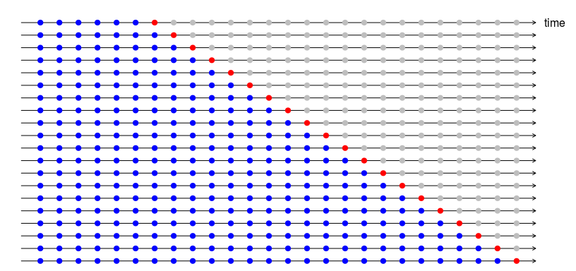

# 시계열 분석1
```{r, cache=TRUE, include = FALSE} 
library(dplyr)
library(ggplot2)
library(lubridate)
library(stringr)
library(data.table)
library(kableExtra)
library(plotly)
library(dlookr)
dir <- 'C:/Users/JDW/Desktop/PROJECT/PRODUCEX/CRAWLING DATA/2020ver'
boylist <- readLines('C:/Users/JDW/Desktop/PROJECT/PRODUCEX/final_boylist.txt')
boylist2 <- str_sub(boylist, -2, -1)
pxdata <- readRDS(str_glue('{dir}/pxdata.rds'))
temp <- c()
total <- c()
for(i in seq(1, length(boylist2))){
    # print(i)
    temp <- pxdata %>%
        filter(str_detect(p_title, boylist2[i])) %>%
        group_by(p_ymd) %>%
        summarise(sum_mention   = n(),
                  sum_comment   = sum(p_comment_num, na.rm = T),
                  sum_count     = sum(p_count),
                  sum_recommend = sum(p_recommend)) %>%
        mutate(boy = boylist[i])

    total <- rbind(total, temp)
}
```

&nbsp;기후나 주가지수와 같이 시간에 따라 관찰된 값들을 분석하는 경우 시계열분석 기법을 사용합니다. 과거의 값들을 토대로 미래의 값을 추정하거나 패턴들의 특징을 파악하기 위해 분석하는 기법입니다. 이전에 일간별로 수집한 데이터들을 전처리하여 연습생별 언급량을 계산하는 과정을 진행하였었는데 오늘은 이 데이터를 활용, 각 연습생별 적절한 모델을 찾고 해당 모델을 토대로 예측값을 도출하여 이를 비교하는 과정을 진행하겠습니다.   

## `ts`객체 
&nbsp;time-series의 약자인 `ts`객체는 이름에 나와있는 것처럼 시계열분석을 위해 사용되는 객체 중 하나입니다. 시간의 흐름에 따라 연속적인 속성을 지닌 변수에 `ts()`함수를 적용하여 생성할 수 있으며, 시계열에 존재하는 주기를 `frequency` 옵션을 사용하여 지정할 수 있는것이 특징입니다. 이전장에서 사용한 `total`변수를 사용하여 연습생들의 언급량의 총 합을 계산하여 이를 ts객체로 생성해 보겠습니다. 
```{r, message=FALSE, warning=FALSE}
library(dplyr)

ts_mention <- total %>% 
    group_by(p_ymd) %>% 
    summarise(sum_mention = sum_mention %>% sum()) %>% 
    ts(frequency = 7)

ts_mention
```

## 모델링 
### 시계열 회귀 모델
&nbsp;`forecast`패키지에 포함되어 있는 `tslm()` 함수는 시계열 회귀분석을 하는데 용이한 함수입니다. 일반적으로 `lm()`함수와 동일한 기능을 수행하지만 시계열 데이터가 보유하고 있는 계절성과 추세를 자동으로 계산하여 각각 `season`, `trend` 변수로 치환하고, 이를 회귀분석에 사용할 수 있도록 해줍니다. 
```{r, message=FALSE, warning=FALSE}
library(forecast)

# tslm 모델 생성 
mod_tslm <- tslm(sum_mention ~ trend + season, data = ts_mention)

# 모델 결과 
mod_tslm %>% summary()
```

&nbsp;생성된 모델의 결과를 살펴보면 자동으로 추세변수와 계절성 변수를 계산하여 이를통해 회귀식을 생성한 것을 볼 수 있습니다. 이렇게 생성된 모델을 `forecast()`함수를 통해 미래의 예측값을 도출해 낼 수 있습니다. 
```{r}
# 예측값 도출 
mod_tslm_pred <- mod_tslm %>% forecast(h = 7)
mod_tslm_pred
```

&nbsp;모델을 통한 예측값의 점추정 값과 신뢰구간을 계산해 줌을 볼 수 있습니다. 이렇게 계산된 예측값을 시각화하여 볼 수 있습니다. 
```{r}
# 예측값 시각화 
mod_tslm_pred %>% plot()
```

&nbsp;최종적으로 모델을 사용하기 이전에 모델의 성능을 측정하여 해당 모델이 다른 모델에 비해 성능적으로 우위가 있는지를 판단할 수 있습니다. 모델의 성능을 측정하는 방법에는 다양한 방법들이 존재합니다. 함수 `accuracy()`를 사용하면 주요 성능을 계산하여 보여줌으로서 모델의 성능을 파악하는데 용이합니다. 
```{r}
# 모델 정확성 
mod_tslm_pred %>% accuracy()
```

### ETS 
&nbsp;지수평활법(Exponential Smoothing)은 과거 시점의 값들을 지수적으로 감쇠시키는 가중치를 부여, 그 과정에서 시계열 데이터가 지니고 있는 추세적 특징과 계절성을 함께 사용하여 미래값을 추정하는 방식입니다. `ets()`함수를 통해 사용할 수 있습니다.   

```{r}
# ETS 모델 생성 
mod_ets <- ets(ts_mention[, 'sum_mention'])

mod_ets

# ETS 모델 예측값
mod_ets_pred <- mod_ets %>% forecast(h = 7)

# ETS 모델 예측값 시각화 
mod_ets_pred %>% plot()

# ETS 모델 성능 
mod_ets_pred %>% accuracy()
```

### ARIMA
&nbsp;시계열 데이터의 자기회귀성을 통해 미래값을 추정하는 arima 모델을 사용하여 미래값을 추정할 수 있습니다. arima 모델은 평균과 분산이 일정한 정상성의 성격을 가진 시계열 데이터를 자기회귀모델(Auto-Regressive model)과 이동평균모델(Moving Average model)을 결합한 모델로서 각각 특정 과거시점까지의 계수의 자기상관성과 오차의 자기상관성을 하나의 모델로서 구현한 것입니다. 본래 arima 모델을 구하기 위해서는 먼저 차분을 통한 시계열의 정상성 확보 이후 ACF와 PACF를 통한 적절한 AR 차수와 MA 차수를 구하는 과정이 필요하지만 R에서 제공하는 `auto.arima()`함수는 (AICc값의 최소로 하는 모델을 찾아) 최적의 arima 모델을 찾아 반환하여 줍니다. 
```{r, cache=TRUE}
# arima 모델 생성 
mod_arima <- auto.arima(ts_mention[, 'sum_mention'], stepwise = FALSE)

mod_arima

# arima 모델 예측값
mod_arima_pred <- mod_arima %>% forecast(h = 7)

# arima 모델 예측값 시각화 
mod_arima_pred %>% plot()

# arima 모델 성능 
mod_arima_pred %>% accuracy()
```


## 모델 평가 
&nbsp; `accuracy()`함수를 통해 계산한 모델들의 성능을 대조해 봄으로서 각 모델들의 성능을 한눈에 파악하고, 최적의 퍼포먼스를 보여주는 모델을 파악하여 최종 사용 모델로 선정할 수 있습니다. 생성한 모델들의 성능을 하나의 데이터 프레임으로 묶어 지표 기준으로 재정렬하는 과정을 진행합니다. 
```{r}
# 모델별 정확도 변수 생성  
mod_tslm_accuracy  <- mod_tslm %>% accuracy()
mod_ets_accuracy   <- mod_ets %>% accuracy()
mod_arima_accuracy <- mod_arima %>% accuracy()

# 모델 정확도 이름 지정
dimnames(mod_tslm_accuracy)[[1]]  <- 'mod_tslm'
dimnames(mod_ets_accuracy)[[1]]   <- 'mod_ets'
dimnames(mod_arima_accuracy)[[1]] <- 'mod_arima'

# RMSE 기준 정렬 
rbind(mod_tslm_accuracy, mod_ets_accuracy, mod_arima_accuracy) %>% 
    as.data.frame() %>% 
    arrange(RMSE)

# MAPE 기준 정렬 
rbind(mod_tslm_accuracy, mod_ets_accuracy, mod_arima_accuracy) %>% 
    as.data.frame() %>% 
    arrange(MAPE)

# ACF1(1시차 자기상관성) 기준 정렬 
rbind(mod_tslm_accuracy, mod_ets_accuracy, mod_arima_accuracy) %>% 
    as.data.frame() %>% 
    arrange(ACF1)
```

&nbsp;거의 모든 지표에서 arima 모델이 우위에 있는것으로 나오나 RMSE에서만은 ets 모델이 근소하게 우위에 있는것을 확인할 수 있습니다. 

## 시계열 교차 검증 
```{r, echo=FALSE, message=FALSE, warning=FALSE, out.width = '100%', fig.align='center'}

```

&nbsp;단일 데이터에 대한 모델링은 모델이 데이터의 특성을 지나치게 학습하여 일반화된 예측에서 성능이 되려 떨어지게 되는 과적합의 위험성이 있습니다. 모델의 과적합을 방지하기 위해 데이터의 부분추출을 통한 학습을 여러번 수행하고, 각 학습마다의 성능을 측정하여 그 성능값을 평균내는 방식의 교차검증을 통해 과적합의 위험성을 방지할 수 있습니다.   

&nbsp;시계열 데이터에서의 교차검정은 `tsCV()`함수를 통해 수행할 수 있습니다. `tsCV()`함수는 특정 과거시점 까지의 데이터를 학습하고 누적 순차적으로 최신 데이터까지의 학습을 수행하는데 output으로 모델의 잔차를 반환하여 줍니다. 해당 잔차를 통해 각 모델별 성능을 계산하여 비교를 진행, 최적의 모델을 선택하여 사용할 수 있습니다. 

### 교차검증 함수 생성 
&nbsp; `tsCV()`의 인수로 시계열 모델링을 수행할 함수를 지정하는 과정이 필요합니다. 시계열 교차검증에 적합한 모델 함수를 생성하도록 하겠습니다. 
```{r, message=FALSE, warning=FALSE, cache=TRUE}
# 시계열 교차검증용 모델 생성 
forecast_arima <- function(x, h){
    auto.arima(x, stepwise = FALSE) %>% forecast(h = h)
}
forecast_tslm <- function(x, h){
    tslm(x ~ trend + season, data = x) %>% forecast(h = h)
}
forecast_ets <- function(x, h){
    ets(x) %>% forecast(h = h)
}

# 교차검증 잔차 
tslm_cv_residual  <- tsCV(ts_mention[, 'sum_mention'], forecast_tslm, h = 1)
ets_cv_residual   <- tsCV(ts_mention[, 'sum_mention'], forecast_ets, h = 1)
arima_cv_residual <- tsCV(ts_mention[, 'sum_mention'], forecast_arima, h = 1)

# 모델 평가 매트릭 함수 생성(RMSE)
RMSE <- function(res){
    mean(res^2, na.rm = TRUE)^0.5
}

data.frame(
    tslm  = tslm_cv_residual %>% RMSE(),
    ets   = ets_cv_residual %>% RMSE(), 
    arima = arima_cv_residual %>% RMSE()
)
```

&nbsp;모델별 교차검증 결과로 나온 잔차에 RMSE를 기준으로 계산한 결과 시계열 회귀 모델(tslm)의 성능이 상대적으로 우수한 것으로 판별이 되었습니다. 

### 최종 모델링
&nbsp;교차검증 모델 평가를 통해 시계열 회귀 모델을 사용하는 것이 괜찮다고 나왔으므로 이전에 생성한 시계열 회귀 모델을 최종 모델로 선정하겠습니다. 
```{r}
mod_tslm <- tslm(sum_mention ~ trend + season, data = ts_mention)
```

### 잔차 검정 
&nbsp;마지막으로 시계열 모델의 잔차가 백색잡음을 띄는지를 검정하도록 하겠습니다. 만약 잔차에 패턴 혹은 상관성이 존재할 경우 모델이 이는 회귀모델의 독립성 가정에 위배되므로 잘못된 모델이라고 할 수 있습니다.   
```{r}
mod_tslm %>% checkresiduals()
```
&nbsp; 생성된 그래프의 잔차분포는 조금은 치우쳐 있지만 정규분포의 형태와 흡사해 보이고 acf역시 크게 이상은 없어보입니다. `checkresiduals()`함수는 모델이 회귀분석 모델이면 Breusch-Godfrey test를, 그렇지 않으면 Ljung-Box test를 진행합니다. 두 검정법 모두 귀무가설로 잔차의 상관성이 통계적으로 유의성이 존재하지 않는다 정의하고 있습니다.(백색잡음이라 보여짐) `checkresiduals()`함수의 결과로 p_value > 0.05 인 것을 보아 모델의 잔차에는 이상이 없어 보입니다.   

### 예측 
&nbsp;잔차검정까지 마친 모델을 대상으로 미래 시점의 값을 추정해 볼 수 있습니다. 앞서 사용한 `forecast()`함수를 통해 시계열 회귀 모델의 미래 추정값을 계산하고, 이에대한 신뢰구간을 계산하여 파악할 수 있습니다.    
```{r}
mod_tslm %>% forecast(h = 7)
```

&nbsp;모델을 생성하는데 사용된 총 언급량 데이터와 이를 시계열 회귀모델에 적합한 값 그리고 회귀모델의 예측값까지 시각화하여 확인할 수 있습니다. `ggplot2` 문법을 따르는 `autoplot()`함수를 통해 시계열 시각화를 수월하게 할 수 있습니다.   
```{r}
library(ggplot2)

ts_mention[, 'sum_mention'] %>% 
    autoplot(series = 'Original') +  
    autolayer(fitted(mod_tslm), series = 'tslm_fitted') + 
    autolayer(forecast(mod_tslm), h = 7, series = 'tslm_forecast') + 
    scale_color_manual(values = c('Original' = 'black', 'tslm_fitted' = 'red', 'tslm_forecast' = 'blue'),
                       breaks = c('Original', 'tslm_fitted', 'tslm_forecast'))
```

&nbsp;위의 과정을 통해 검정선의 실제 데이터(총 언급량)과 붉은선의 모델에 적합한 값을 비교하여 볼 수 있고, 파란 음영처리된 신뢰구간을 포함한 미래 예측값을 하나의 그래프로 표현하여 한 눈에 볼 수 있습니다.   

# 시계열 분석2
&nbsp;지금까지 연습생들의 언급량을 총 합산한 데이터를 토대로 시계열 예측 과정을 진행하였습니다. 이 과정을 개별 연습생에 대한 언급량 데이터에 적용하여 각각의 연습생들에 적법한 모델을 찾고 그 모델을 토대로 바로 다음 시점의 언급량을 추정, 이를 대조하여 언습생들의 인기를 추측해 보겠습니다.   

## 연습생별 모델링 함수 생성
```{r, message=FALSE, warning=FALSE, results='hide', cache=TRUE}
# 연습생별 최적 성능 모델 생성 함수 
boy_model <- function(total, final_boy){
    # 연습생 언급량 필터링 & ts 객체 변환 
    boy_ts <- total %>% 
        filter(boy == final_boy) %>% 
        ts(frequency = 7)
    
    # 시계열 교차검증용 모델 지정 
    forecast_arima <- function(x, h){
        auto.arima(x, stepwise = FALSE) %>% forecast(h = h)
    }
    forecast_tslm <- function(x, h){
        tslm(x ~ trend + season, data = x) %>% forecast(h = h)
    }
    forecast_ets <- function(x, h){
        ets(x) %>% forecast(h = h)
    }
    
    # 모델 평가 매트릭 함수 지정(RMSE)
    RMSE <- function(y){
        mean(y^2, na.rm=TRUE)^0.5
    }
    
    # 시계열 교차검증 
    tslm_cv_residual  <- tsCV(boy_ts[, 'sum_mention'], forecast_tslm, h = 1)
    ets_cv_residual   <- tsCV(boy_ts[, 'sum_mention'], forecast_ets, h = 1)
    arima_cv_residual <- tsCV(boy_ts[, 'sum_mention'], forecast_arima, h = 1)
    
    # 최적 성능순 모델 이름 추출   
    models <- data.frame(model = c('tslm', 'ets', 'arima'), 
                         score = c(RMSE(tslm_cv_residual), RMSE(ets_cv_residual), RMSE(arima_cv_residual))) %>% 
        arrange(score) %>% 
        .$model
    
    # 모델 적용 함수 
    select_model <- function(type){
        
        if(type == 'tslm'){
            final_model <- tslm(sum_mention ~ trend + season, data = boy_ts)
        }
        
        if(type == 'ets'){
            final_model <- ets(boy_ts[, 'sum_mention']) 
        }
        
        if(type == 'arima'){
            final_model <- auto.arima(boy_ts[, 'sum_mention'], stepwise = FALSE)
        }
        
        return(final_model)
    }
    
    # 최적 모델 적용 
    for(model in models){
        # print(model)
        final_model <- select_model(type = model)
        
        # 잔차검정 
        if(checkresiduals(final_model, plot = FALSE)$p.value > 0.05){
            # 테스트 통과시 for문 종료
            break
        }
    }
    
    # 모든 모델이 잔차검정 통과 못할 시 
    # 차선책으로 가장 좋은 성능을 내는 첫번째 모델 선택
    if(checkresiduals(final_model, plot = FALSE)$p.value <= 0.05 && model == models[3]){
        
        model <- models[1]
        
        final_model <- select_model(type = model)
    }
    
    # 최적 모델, 사용된 모델명 반환 
    boy_model <- list(
        model     = final_model, 
        use_model = model
    )
    
    return(boy_model)
}

final <- c()
final_boy <- c()
for(final_boy in boylist){
    print(final_boy)
    final[[final_boy]] <- boy_model(total, final_boy)
}

```

&nbsp;연습생 개개인의 상황에 맞는 우수한 성능 모델을 찾아 잔차검정까지 마친 최적의 모델을 찾아 반환하는 `boy_model()`함수를 사용하여 그 결과물을 `final` 객체에 저장하였습니다.   

## 사용 모델 확인 
&nbsp;연습생들에 적용된 최적의 모델이 무엇인지 확인하겠습니다.   
```{r}
final %>% 
    purrr::map(function(x){x$use_model}) %>% 
    do.call(rbind, .) %>% 
    as.data.frame() %>% 
    kableExtra::kable() %>% 
    stringr::str_remove('V1') %>%
    shiny::HTML()
```

&nbsp;연습생별 최적 모델을 찾는 함수에서 지정한 `use_model`변수는 개별 모델을 적용할 때 사용한 모델의 이름을 저장한 변수입니다. 이 변수만을 별도로 보니 연습생별로 모델을 적용하는데 있어서 대체로 arima 모델과 시계열 회귀모델이 선택되고 ets 모델은 상대적으로 덜 선택된 것을 볼 수 있습니다. 이처럼 언급량 데이터는 성격과 형태가 유사한 데이터 이지만 데이터가 지닌 시계열적 특징에 따라 적용된 모델이 상이한 것을 확인할 수 있었습니다. 

## 모델 시각화 
&nbsp;개개인의 데이터에 맞춘 모델을 이전장에서 했던 유사한 시각화 방식으로 파악할 수 있습니다. 생성된 모델과 실제 데이터를 모델에 적합한 값 그리고 모델이 예측한 값을 연습생별로 시각화하여 살펴보도록 하겠습니다. 

```{r, cache = TRUE, warning=FALSE, message=FALSE}
# 모델 시각화 함수 생성  
library(tidyquant)

boy_plot <- function(boy){
    forecast(final[[boy]]$model, h = 7) %>% 
        autoplot() + 
        autolayer(fitted(final[[1]]$model), series = 'fitted', color = 'red') + 
        scale_x_continuous(breaks = seq(1, 9), 
                           labels = str_glue("{(seq(1, 7) + 4) %>% append(c('final', 'predict'))}")) + 
        theme_tq() + 
        labs(subtitle = boy, x = 'episode', y = 'sum_mention') + 
        theme(plot.subtitle = element_text(hjust = 1, size = 12)) 
}

# 연습생별 모델 그래프 저장 
i = 0
final_plot <- c()
for(i in seq(1, 20)){
    final_plot[[i]] <- boy_plot(boylist[i])
}
```

```{r, eval=FALSE}
library(gridExtra)
do.call('grid.arrange', c(final_plot, ncol = 1))
```

```{r, echo=FALSE, warning=FALSE, message=FALSE, cache=TRUE}
# 시각화 
library(gridExtra)
do.call('grid.arrange', c(final_plot[1:3], ncol = 1))
do.call('grid.arrange', c(final_plot[4:6], ncol = 1))
do.call('grid.arrange', c(final_plot[7:9], ncol = 1))
do.call('grid.arrange', c(final_plot[10:12], ncol = 1))
do.call('grid.arrange', c(final_plot[13:15], ncol = 1))
do.call('grid.arrange', c(final_plot[16:18], ncol = 1))
do.call('grid.arrange', c(append(final_plot[19:20], list(ggplot() + theme_void())), ncol = 1))
```

&nbsp;방송이 방영된 회차에 발생한 실제 언급량을 검정선에, 생성된 모델에 실제 언급량을 반영한 모델값을 붉은색선, 그리고 방송이 끝난 후의 언급량을 모델이 예측한 값을 푸른색 신뢰구간과 함께 파란색선으로 표현하였습니다. 연습생별로 모델이 추정한 미래 값이 서로 상이한 것을 볼 수 있습니다.   

## 결론 
&nbsp;지금까지 적지 않은 과정을 통해 시계열 분석 절차를 진행 해 왔습니다. 모델에 사용된 데이터는 커뮤니티 게시판에서 시청자들 혹은 방송에 관심이 있는 유저들이 작성한 게시글의 제목으로, 이 제목 중 특정 연습생 인물의 이름 또는 별명을 일간별로 계산하여 이를 시계열 모델로 생성하였는데요. 이제 해당 개별 모델들이 추정한 방송이 끝난 한 시점 이후의 미래값을 비교하여 연습생들의 (추정 언급량)순위를 매겨 보겠습니다.    

&nbsp;모델을 생성하였으면 미래값을 추정하는 것은 그리 어려운 일이 아닙니다. 지금까지 자주 사용하였던 `forecast()`함수를 사용하여 개개인의 미래값을 도출하고 이를 하나의 데이터프레임으로 묶겠습니다. 

```{r}
library(purrr)

compare_pred <- final %>% 
    map(function(x){
        x$model %>% 
            forecast(h = 7) %>% 
            as.data.frame() %>% 
            map_df(mean)
    }) %>% 
    do.call(rbind, .)

compare_pred
```

&nbsp;예측은 모델이 바로 1 시점 이후를 예측하는 것이 아닌 시계열 데이터가 지니고 있는 주기적인 반복성인 계절성의 영향을 고려하여 모델의 7 예측 시점 까지를 구하고 이를 평균낸 값을 활용하도록 하겠습니다. 각 모델별로 7 시점 미래 값을 평균내어 예측 신뢰구간과 함께 점추정값을 하나의 객체에 저장하였습니다. 여기서 비교의 대상이 될 점추정값(Point Forecast)값을 기준으로 연습생들을 재정렬, 이를 순위매겨보도록 하겠습니다.   
```{r, message=FALSE, warning=FALSE}
model_rank <- compare_pred %>% 
    arrange(desc(`Point Forecast`)) %>% 
    mutate(rank = row_number(), 
           boy  = rownames(.)) %>% 
    select(rank, boy, `Point Forecast`)

library(kableExtra)

kable(model_rank, align = 'c') %>% 
    kable_styling(bootstrap_options = "striped", full_width = T, position = "center")
```

&nbsp;모델이 추정한 미래값을 기준으로 최종 11명을 뽑자면 **조승연**, **김우석**, **구정모**, **이은상**, **한승우**, **김민규**, **김요한**, **남도현**, **강민희**, **금동현**, **황윤성** 순으로 뽑을 수 있겠습니다.   

&nbsp;이전 5장에서 순위를 매겼던 방식인 방송 기간 중 연습생별 총 언급량 기준, 그리고 방송의 마지막 주차(11주차)를 기준으로 정렬한 언급량 순위랑 비교해보면 어떠한 차이가 있을지 비교해 보도록 하겠습니다. 

```{r, warning=FALSE, message=FALSE, cache=TRUE}
library(stringr)

temp_mention <- c()
episode_mention <- c()
for(i in seq(1, 20)){
    temp_mention <- pxdata %>%
        filter(str_detect(p_title, boylist2[i])) %>%
        group_by(p_episode) %>%
        summarise(mention =n()) %>%
        mutate(boy = boylist[i])
    
    episode_mention <- rbind(episode_mention, temp_mention)
}

week11_rank <- episode_mention %>% 
    filter(p_episode == 11) %>% 
    arrange(desc(mention)) %>% 
    mutate(week11_rank = row_number()) %>% 
    rename(week11_mention = mention) %>% 
    select(week11_rank, boy, week11_mention)

total_rank <- episode_mention %>% 
    group_by(boy) %>% 
    summarise(total_mention = sum(mention)) %>% 
    arrange(desc(total_mention)) %>% 
    mutate(total_rank = row_number()) %>% 
    select(total_rank, boy, total_mention)

all_rank <- model_rank %>% 
    rename(model_rank = rank) %>% 
    left_join(week11_rank, by = 'boy') %>%
    left_join(total_rank , by = 'boy') %>% 
    select(model_rank, week11_rank, total_rank, boy, `Point Forecast`, week11_mention, total_mention)

```

```{r, message=FALSE, warning=FALSE}
library(DT)

my_table <- function(dt){
    dt %>% datatable(rownames = F, 
                     options = list(dom = 't', 
                                    pageLength = 20, 
                                    columnDefs = list(list(className = 'dt-center', targets = 0:6)),
                                    # column name 사이즈 조절 
                                    headerCallback = DT::JS(
                                        "function(thead) {",
                                        "  $(thead).css('font-size', '0.8em');",
                                        "}"
                                    ) 
                     )
    ) %>% 
        formatRound("Point Forecast", 2) %>% 
        formatStyle(columns = colnames(.), fontSize = '70%') 
}

my_table(all_rank)

```

&nbsp;기준별로 순위는 상이하지만 상위권과 하위권이 대체로 유사하게 나타나는 것처럼 보입니다. 그렇다면 모델이 추정한 값의 순위, 11주차 기준 순위, 전체 언급량 순위 모두에서 데뷔 순위로 나타나는 연습생과 그렇지 않은 연습생은 어떠한지 보겠습니다. 

```{r}
# 모든 기준에 들어가는 연습생 
all_rank %>% 
    filter(model_rank  %in% seq(1, 11)) %>% 
    filter(week11_rank %in% seq(1, 11)) %>% 
    filter(total_rank  %in% seq(1, 11)) %>% 
    my_table()

```

&nbsp;모든 기준에서 최종 데뷔조로 나타나는 연습생은 각각 **조승연**, **김우석**, **구정모**, **이은상**, **한승우**, **김민규**, **김요한**, **남도현**이 좋은 수치를 내는 것을 볼 수 있습니다. 

```{r}
# 모든 기준에 들어가지 않는 연습생 
all_rank %>% 
    filter(!model_rank  %in% seq(1, 11)) %>% 
    filter(!week11_rank %in% seq(1, 11)) %>% 
    filter(!total_rank  %in% seq(1, 11)) %>% 
    my_table()
```

&nbsp;한편 **송유빈**, **차준호**, **토니**, **이한결**, **손동표**, **함원진**, **이세진** 연습생들은 모든 기준에서도 데뷔조에 들어가지 않는것으로 나오고 있습니다. 하지만 해당 결과를 실제 예측에 반영하기는 무리가 있는점이 있습니다. *신뢰구간*을 고려하지 않은 점추정 값의 비교는 자칫 치명적인 오류를 범할 수 있기 때문입니다. 예를들어 어느 두 사람의 추정값이 상대적으로 높게 나오더라도 신뢰구간이 겹치게 된다면 이는 실제 두사람의 결과가 얼마든지 바뀔 수 있기 때문입니다.  

```{r}
final[['송형준']]$model %>% 
    forecast(h = 7) %>% 
    autoplot(conf.int.fill = 'royalblue1', conf.int.alpha = 0.2) + 
    autolayer(final[['황윤성']]$model$data$sum_mention,    color = 'violetred4')  + 
    autolayer(final[['황윤성']]$model %>% forecast(h = 7), color = 'red',  alpha = 0.2) + 
    labs(title = "황윤성 - 송형준 95% 신뢰구간 비교")
```

&nbsp;그래프에 붉은색으로 음영처리된 부분은 모델이 데뷔조의 마지막 등수인 11등으로 예측한 **황윤성**의 95% 신뢰구간을 표시한 것이고, 푸른색 음영처리 부분은 12등으로 예측한 **송형준**의 신뢰구간을 의미합니다. 신뢰구간인 즉슨 실제 값이 신뢰구간에 속할 확률이 95%란 의미인데 이처럼 겹쳐있는 부분이 존재하면 특히 겹쳐있는 부분의 범위가 넓을수록 쉽사리 누가 우위에 있는지를 속단하기 어려운 의미입니다.   

&nbsp;또한 데이터의 출처를 생각해 보자면 특정 커뮤니티에서의 의견이기 때문이기 때문에 커뮤니티에 활동하는 유저의 *성향*에 따라 데이터가 편향이 될 가능성이 높습니다. 수집한 데이터의 출처가된 커뮤니티의 유저들이 전체 시청자들의 의견을 대변하는건 아니기 때문에 해당 모델링 결과를 통해 최종 예측을 하기엔 다소 무리가 있습니다.    

&nbsp;그렇다면 진행한 모델링의 결과는 의미가 없냐? 또 그렇진 않습니다. 분석의 대전제가 된 언급량이 많을수록 인기가 있을것이다란 것에 맞춘 모델링이기에 여기서의 값이 높게 나온 연습생은 실제로 인기가 높은 연습생일 확률이 높습니다. 또한 높은 확률로 데뷔조에 속할 가능성이 있습니다.       

&nbsp;실제로 모델의 예측치 순위에서 3위에 있는 **구정모** 연습생과 10위의 **금동현** 연습생은 제작진의 (조작된) 방송의 최종 순위에서는 탈락한 것으로 발표 되었지만 (재판 과정에서 드러난) 실제 순위에선 각각 6위, 8위를 기록하여 최종 데뷔조 였단 것이 밝혀졌었습니다. 모델의 결과를 전적으로 신뢰하긴 어렵지만 어떤 연습생이 인기가 있었는지 참고하기엔 좋은 자료인 것 같습니다. 


--- 

<br>
&nbsp;지금까지 데이터 수집부터 모델 예측까지 다양한 절차를 통해 분석을 진행하였습니다. 최종 투표에서 조작이 있었다는 의혹으로 인해 지난해 말 프로듀스 X 101은 의혹에 대한 재판이 진행되었었고, 재판의 결과로 실제로 제작진의 투표조작이 있었다는 발표가 있었습니다. 처음 이 분석을 기획한 당시에 시청자들의 의견이 담긴 텍스트를 분석하면 최종적으로 선발될 연습생이 누군지 알 수 있지 않을까란 생각과, 이를 실제 결과와 대조하면 유의미한 결과가 있지 않을까 싶어 진행하였지만 실상은 모든것이 제작진의 조작이였다는 발표를 듣게 되니 약간은 허탈하면서도 평소 프로그램을 즐겨보던 한명의 시청자로서 아쉬운 발표이기도 했었습니다. 재판 이후에 나온 관련 기사들을 읽다보니 지금껏 너무 순진하게 방송국놈들을 믿었던건 아닌지 싶은 생각이 들기도 하더군요 ^^; 재판으로 밝혀진 사실이 궁금하신 분들은 [판결문 전문](https://legalengine.co.kr/cases/50035495) 또는 잘 정리된 [기사](http://www.newdaily.co.kr/site/data/html/2021/01/22/2021012200179.html#livereGuideBtn)에서 확인 하실 수 있습니다. 이것으로 프로듀스 X 101 데뷔 예측 분석을 마치도록 하겠습니다. 


